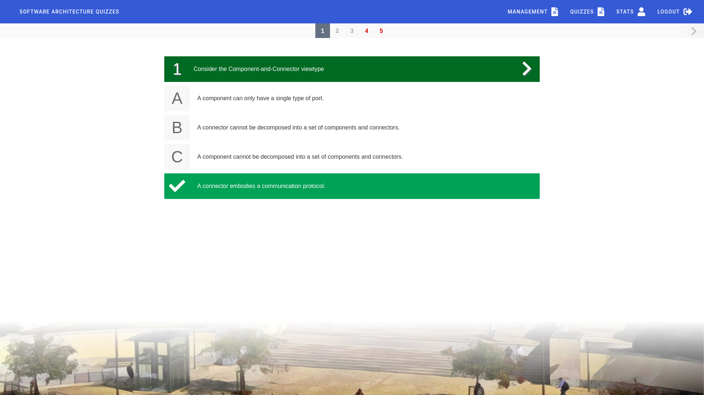

# Quizzes Tutor

<div align="center">
  
</div>

<h4 align="left">Vue web application and Spring-boot API</h4>
<h4 align="center">with multiple choice questions for students</h4>
<h4 align="right">and quiz management for teachers</h4>

<p align="center">
  
  
  
  
  
  
</p>

<p align="center">
  <a href="#about">About</a> •
  <a href="#technologies">Technologies</a> •
  <a href="#installation">Installation</a> •
  <a href="#patreons">Patreons</a> •
  <a href="#contributing">Contributing</a> •
  <a href="#license">License</a>
</p>

# About



**Quizzes Tutor** allows professors from [IST](https://tecnico.ulisboa.pt/pt/) to create multiple choice questions with images and topics which can be inserted in assessments and quizzes.
Students can then answer those questions in sugested quizzes or generated quizzes (pseudo-random) providing them with a usell **self-assessment tool** to improve their learning.

# Technologies

* Require download
  * [Postgres 10 or 12](https://www.postgresql.org/)
  * [Java 11](https://www.oracle.com/technetwork/java/javase/downloads/jdk11-downloads-5066655.html)
  * [Maven](https://maven.apache.org/download.cgi)
  * [Node 12.14](https://nodejs.org/en/)
  * [Docker](https://www.docker.com/)
* No download required
  * [Spring-boot](https://spring.io/)
  * [Vue.js](https://vuejs.org/)

# Installation

* **Install**
```
sudo apt update
sudo apt install postgresql nodejs npm
```
* **Change to postgres user and create DB**
```
sudo su -l postgres
dropdb tutordb
createdb tutordb
```
* **Create user to access db and load dump**
```
psql tutordb
CREATE USER your-username WITH SUPERUSER LOGIN PASSWORD 'yourpassword';
psql tutordb < dump.sql
```
* **Go to https://fenix.tecnico.ulisboa.pt/personal/external-applications/#/applications and create an application that redirects to http://tolocalhost.com:8081/login and accessess curricular information**
* **Add `127.0.1.1	tolocalhost.com` to your `/etc/hosts` file so Oauth with fenix works locally**
* **Rename `spring-api/src/main/resources/application-dev.properties.example` to `application-dev.properties` and fill its fields**
* **Run server**
```
cd spring-api
mvn clean spring-boot:run
```
* **See documentation on http://localhost:8080/swagger-ui.html**
* **Rename `frontend/example.env` to `.env` and fill its fields**
* **Run frontend**
```
cd frontend
npm i
npm start
```
* **Access http://localhost:8081**

# Patreons

A special thanks to our patreons for supporting this project:

<table>
  <tr>
    <td width="30%"></td>
    <td width="30%"></td>
    <td width="30%"></td>
  </tr>
</table>

# Contributing

Your contributions are always welcome! Please have a look at the [contribution guidelines](https://github.com/socialsoftware/as-tutor/wiki/Guidelines) first.

# License

This project is licensed under the MIT License - see the [LICENSE.md](LICENSE.md) file for details.
